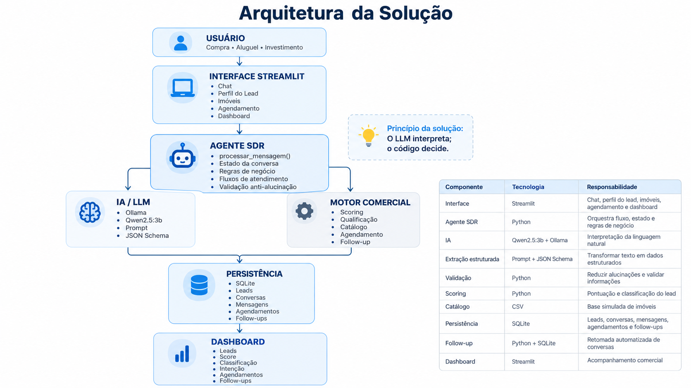

# Tech Challenge Fase 5 — Agente SDR Imobiliário com Inteligência Artificial

## 📌 Visão Geral

Este projeto foi desenvolvido como parte do **Tech Challenge — Fase 5 da Pós Tech FIAP**.

A proposta é uma Prova de Conceito (POC) de um **Agente SDR Imobiliário com Inteligência Artificial**, capaz de automatizar as primeiras etapas do atendimento comercial no setor imobiliário.

A solução permite:

- conversar com leads em linguagem natural;
- identificar intenção de **compra, aluguel ou investimento**;
- coletar informações relevantes progressivamente;
- qualificar leads por meio de scoring;
- classificar leads como **Frio, Morno ou Quente**;
- consultar um catálogo imobiliário simulado;
- apresentar imóveis compatíveis;
- registrar interesse e visitas;
- manter memória conversacional;
- retomar conversas;
- executar follow-ups;
- gerar resumo comercial;
- responder dúvidas imobiliárias com **RAG**;
- acompanhar indicadores em dashboard.

> ⚠️ Projeto acadêmico. Os dados utilizados são simulados e não representam uma operação imobiliária real.

---

## 👥 Integrantes e Responsabilidades

| Integrante |Responsabilidade Principal |
|---|---|
| karim Mendes Yehia - karim.mendes@gmail.com RM 369430 | Núcleo de IA, integração com LLM, prompts, estado e contrato do agente |
| Michele Rodrigues Hempel Lima - engmichelerodrigues@gmail.com RM 369176 | Interface Streamlit, integração dos módulos, SQLite, follow-up, dashboard e consolidação da demonstração |
| Wellington Fernandes do Carmo - wellingtonfernandes@energisa.com.br RM 369631 | Fluxos funcionais, regras conversacionais, cenários, testes e documentação |
| Rúben Gonçalves Rocha - ruben@energisa.com.br RM 370092 | Bases de dados, qualificação, scoring, dashboard e apoio ao fluxo de agendamento |

---

## 🎯 Objetivos da Solução

O agente foi projetado para automatizar o atendimento inicial e apoiar a qualificação comercial de leads imobiliários.

Os principais objetivos são:

- oferecer atendimento natural e contextual;
- identificar automaticamente a intenção do lead;
- coletar dados sem depender de formulários rígidos;
- manter continuidade da conversa;
- priorizar leads por meio de scoring;
- recomendar imóveis compatíveis;
- apoiar visitas e encaminhamento comercial;
- realizar follow-up de conversas interrompidas;
- fornecer respostas baseadas em uma base de conhecimento;
- consolidar informações para o corretor ou especialista;
- disponibilizar indicadores comerciais em dashboard.

---

# 🏗️ Arquitetura da Solução

A aplicação utiliza uma arquitetura modular, separando interface, agente, IA, regras de negócio, recuperação de conhecimento, catálogo e persistência.

<p align="center">
  
</p>

### Visão geral

```text
Usuário / Lead
      ↓
Interface Streamlit
      ↓
    app.py
      ↓
   agent.py
      │
      ├──────────── Fluxo SDR ────────────┐
      │                                    │
      │                             Prompt + contexto
      │                                    ↓
      │                              Qwen2.5:3b
      │                              via Ollama
      │                                    ↓
      │                           Extração estruturada
      │                              JSON Schema
      │                                    ↓
      │                          Validação determinística
      │                                    │
      │                                    ↓
      │                         Scoring / Qualificação
      │                                    ↓
      │                              Catálogo CSV
      │
      └────────────── RAG ─────────────────┐
                                           │
                               Base de conhecimento
                        data/conhecimento_imobiliario.md
                                           ↓
                                  TF-IDF + similaridade
                                     de cosseno
                                           ↓
                                 Contexto recuperado
                                           ↓
                                     Qwen2.5:3b
                                           ↓
                                Resposta fundamentada

                    ↓
                SQLite
                    ↓
     Memória / Agendamentos / Follow-up
                    ↓
                Dashboard
```

> **Princípio da solução:** o LLM interpreta; o código decide.

---

# 💬 Atendimento Conversacional

A interface principal foi desenvolvida em **Streamlit**.

O usuário pode conversar com o agente utilizando linguagem natural.

Exemplo:

```text
Quero comprar um apartamento em Moema por até R$ 2 milhões.
```

O agente pode identificar:

```text
Intenção: Compra
Região: Moema
Tipo: Apartamento
Orçamento: R$ 2.000.000,00
```

Caso ainda existam informações necessárias, o sistema continua a qualificação com novas perguntas.

O atendimento não depende de um formulário rígido: os dados são coletados progressivamente ao longo da conversa.

---

# 🎯 Fluxos de Atendimento

## 🏠 Compra

Entre os principais dados coletados estão:

- orçamento;
- região ou bairro;
- tipo de imóvel;
- quantidade de quartos;
- urgência.

Após a qualificação, o sistema consulta o catálogo e apresenta imóveis compatíveis.

## 🔑 Aluguel

O fluxo de aluguel considera:

- orçamento mensal;
- região ou bairro;
- tipo de imóvel;
- quartos;
- urgência;
- preferências adicionais quando informadas.

A busca é realizada em imóveis disponíveis para locação.

## 📈 Investimento

O fluxo de investimento coleta informações específicas:

- ticket de investimento;
- perfil do investidor;
- retorno anual esperado;
- urgência.

Após a qualificação, o sistema procura oportunidades compatíveis e pode encaminhar o lead para um especialista em investimentos imobiliários.

---

# 🧠 Inteligência Artificial

A solução utiliza o modelo:

```text
Qwen2.5:3b
```

executado localmente por meio do:

```text
Ollama
```

A IA possui dois papéis principais na aplicação:

1. **extração estruturada de informações do lead**;
2. **geração de respostas fundamentadas pelo RAG**.

---

## Extração Estruturada

O LLM interpreta mensagens em linguagem natural e transforma as informações em dados estruturados.

Entre os campos identificados estão:

- intenção;
- orçamento ou ticket;
- região;
- tipo de imóvel;
- quantidade de quartos;
- urgência;
- perfil do investidor;
- retorno esperado;
- preferências adicionais;
- aceite explícito de visita ou reunião.

A saída é controlada por **Prompt Engineering + JSON Schema**.

Fluxo:

```text
Mensagem do usuário
        ↓
Contexto da conversa
        ↓
Prompt
        ↓
Qwen2.5:3b / Ollama
        ↓
JSON estruturado
        ↓
Validação determinística
        ↓
Atualização do estado
        ↓
Regras de negócio
```

---

## 🛡️ Controle de Alucinações

As informações extraídas pelo modelo não são aceitas automaticamente.

Antes de atualizar o perfil, o sistema aplica validações em Python para verificar se os dados foram efetivamente informados pelo usuário ou se correspondem à última pergunta realizada.

Exemplo:

```text
Usuário:
Quero investir em imóveis para renda.
```

O sistema pode aceitar:

```text
Intenção = Investimento
```

mas não deve preencher automaticamente:

```text
Tipo de imóvel = Apartamento
Urgência = Alta
Perfil do investidor = Moderado
```

quando essas informações não foram fornecidas.

Essa abordagem reduz o risco de alucinações afetarem as regras comerciais.

---

# 📚 RAG — Retrieval-Augmented Generation

A aplicação implementa um mecanismo de **RAG** para responder dúvidas imobiliárias utilizando uma base de conhecimento controlada.

A base está armazenada em:

```text
data/conhecimento_imobiliario.md
```

O mecanismo de recuperação está implementado em:

```text
rag.py
```

## Como funciona

```text
Pergunta informativa
        ↓
Busca na base de conhecimento
        ↓
TF-IDF
        ↓
Similaridade de cosseno
        ↓
Recuperação dos trechos relevantes
        ↓
Contexto enviado ao Qwen2.5:3b
        ↓
Resposta baseada no conteúdo recuperado
```

Exemplo:

```text
Usuário:
O que é vacância?

Agente:
Vacância é o período em que um imóvel destinado à locação
permanece sem inquilino.

📚 Base consultada: Vacância
```

Outro exemplo:

```text
Usuário:
Quais custos tenho ao comprar um imóvel?

Agente:
Além do valor do imóvel, a aquisição pode envolver ITBI,
escritura, registro e despesas relacionadas ao financiamento.

📚 Base consultada: Custos relacionados à compra
```

O RAG é utilizado para perguntas informativas. Mensagens relacionadas à qualificação do lead continuam sendo processadas pelo fluxo SDR normal.

Por exemplo:

```text
Quero investir em imóveis.
```

continua o fluxo de qualificação:

```text
Qual valor você pretende investir em imóveis?
```

### Estratégia atual de recuperação

A implementação utiliza:

- base em Markdown;
- divisão por seções;
- `TfidfVectorizer`;
- similaridade de cosseno;
- seleção dos trechos mais relevantes;
- geração final com Qwen2.5:3b.

Essa abordagem permite uma implementação leve e local, sem necessidade de banco vetorial para a POC.

---

# 🧠 Memória Conversacional

A memória não depende exclusivamente do LLM.

O estado da conversa e o histórico são persistidos pela aplicação utilizando **SQLite**.

São armazenadas informações como:

- intenção;
- orçamento;
- região;
- tipo de imóvel;
- quartos;
- urgência;
- perfil do investidor;
- retorno esperado;
- score;
- classificação;
- mensagens;
- agendamentos;
- follow-ups.

A interface permite retomar conversas anteriores, preservando o contexto já coletado.

---

# 🔥 Qualificação e Scoring

A qualificação é realizada por regras determinísticas em Python.

O score varia de:

```text
0 a 100
```

Classificação:

| Score | Classificação |
|---:|---|
| 0–39 | 🔵 Frio |
| 40–69 | 🟡 Morno |
| 70–100 | 🔥 Quente |

## Compra e Aluguel

| Critério | Pontuação |
|---|---:|
| Intenção identificada | 10 |
| Orçamento informado | 20 |
| Região definida | 15 |
| Tipo de imóvel | 10 |
| Quartos | 10 |
| Urgência alta | 15 |
| Urgência média | 10 |
| Urgência baixa | 5 |
| Aceite de visita/reunião | 20 |

## Investimento

| Critério | Pontuação |
|---|---:|
| Intenção identificada | 10 |
| Ticket informado | 20 |
| Região definida | 10 |
| Perfil do investidor | 15 |
| Retorno esperado | 15 |
| Urgência alta | 10 |
| Urgência média | 7 |
| Urgência baixa | 3 |
| Aceite de visita/reunião | 20 |

Caso informações essenciais de investimento ainda estejam ausentes, a pontuação pode ser limitada até a conclusão da qualificação.

---

# 🏘️ Catálogo de Imóveis

A base simulada está em:

```text
data/imoveis.csv
```

O módulo responsável pela consulta é:

```text
catalogo.py
```

Os filtros podem considerar:

- finalidade;
- disponibilidade;
- orçamento;
- região;
- zona;
- tipo de imóvel;
- quantidade mínima de quartos;
- preferências adicionais;
- retorno esperado em cenários de investimento.

O sistema apresenta até três imóveis compatíveis.

---

# 📅 Agendamento

Após demonstrar interesse em um imóvel, o usuário pode registrar uma visita.

São armazenados:

- imóvel;
- data;
- horário;
- observação;
- status.

A aplicação também verifica agendamentos duplicados.

> No fluxo de investimento, o lead também pode ser encaminhado para atendimento de um especialista.

---

# 🔔 Follow-up

A solução possui mecanismo de follow-up para conversas interrompidas.

Fluxo:

```text
Conversa iniciada
        ↓
Lead deixa de interagir
        ↓
Sistema identifica conversa elegível
        ↓
Mensagem contextualizada é criada
        ↓
Follow-up é registrado
        ↓
Lead responde
        ↓
Follow-up passa para Respondido
```

Exemplo:

```text
Olá! 😊 Na nossa última conversa, você estava avaliando
oportunidades de investimento imobiliário, com perfil moderado,
retorno esperado de 8% ao ano e ticket de até R$ 800.000,00.

Gostaria de continuar seu atendimento?
```

A POC também possui **modo de demonstração**, permitindo testar o comportamento sem aguardar o período completo de inatividade.

> Nesta versão, o processamento automático ocorre durante a execução da aplicação. Um ambiente produtivo poderia utilizar um scheduler ou worker independente.

---

# 📋 Resumo Comercial

A aplicação consolida informações relevantes para o corretor ou especialista.

O resumo pode incluir:

- intenção;
- orçamento ou ticket;
- região;
- tipo de imóvel;
- quartos;
- urgência;
- perfil de investimento;
- retorno esperado;
- score;
- classificação;
- imóveis apresentados;
- agendamento;
- follow-up.

---

# 📊 Dashboard Comercial

O dashboard em Streamlit permite acompanhar os principais indicadores da POC.

Entre eles:

- total de leads;
- conversas;
- mensagens;
- agendamentos;
- score médio;
- distribuição entre Frio, Morno e Quente;
- distribuição por intenção;
- leads prioritários;
- follow-ups enviados;
- respostas recebidas;
- taxa de resposta;
- conversas recentes.

---

# 💾 Persistência

A aplicação utiliza **SQLite** para persistência local.

Banco gerado durante a execução:

```text
data/sdr_imobiliario.db
```

As principais entidades armazenadas são:

```text
Leads
Conversas
Mensagens
Agendamentos
Follow-ups
```

O banco de execução não precisa ser versionado no Git.

---

# 🧰 Tecnologias Utilizadas

- Python 3.10+
- Streamlit
- SQLite
- Ollama
- Qwen2.5:3b
- scikit-learn
- TF-IDF
- Similaridade de cosseno
- CSV
- JSON
- Git
- GitHub
- unittest

A comunicação com o Ollama é realizada pela aplicação Python através da API HTTP local.

---

# 📁 Estrutura do Repositório

```text
tech_challenge_fase5/
│
├── app.py
├── agent.py
├── catalogo.py
├── chat_cli.py
├── database.py
├── llm_client.py
├── prompts.py
├── rag.py
├── schemas.py
├── scoring.py
├── README.md
├── .env.example
├── .gitignore
│
├── data/
│   ├── conhecimento_imobiliario.md
│   ├── agendamentos.csv
│   ├── imoveis.csv
│   ├── interacoes.csv
│   ├── leads.csv
│   └── regras_qualificacao.csv
│
├── docs/
│   ├── arquitetura_sdr.png
│   ├── explicacao_ia.md
│   ├── dados/
│   ├── dashboard/
│   ├── desafio/
│   ├── funcional/
│   ├── organizacao/
│   └── testes/
│
└── tests/
    ├── test_agent.py
    └── test_ollama_live.py
```

---

# ⚙️ Configuração do Ambiente

## 1. Clonar o repositório

```bash
git clone https://github.com/ykarimmendes/tech_challenge_fase5.git
cd tech_challenge_fase5
```

## 2. Criar ambiente virtual

```bash
python -m venv .venv
```

### Windows

```powershell
.venv\Scripts\activate
```

### Linux / macOS

```bash
source .venv/bin/activate
```

## 3. Instalar as dependências da POC

Como o repositório ainda não possui um `requirements.txt` versionado, instale ao menos as dependências externas utilizadas pela aplicação:

```bash
pip install streamlit scikit-learn
```

---

# 🤖 Instalação do Ollama

Instale o Ollama e baixe o modelo:

```bash
ollama pull qwen2.5:3b
```

Confirme a instalação:

```bash
ollama list
```

A aplicação utiliza por padrão:

```text
http://localhost:11434
```

As configurações podem ser definidas por variáveis de ambiente.

Referência:

```text
.env.example
```

Exemplo:

```env
OLLAMA_BASE_URL=http://localhost:11434
OLLAMA_MODEL=qwen2.5:3b
```

> O código lê as variáveis do ambiente do sistema. O arquivo `.env.example` é apenas uma referência de configuração.

---

# ▶️ Executando a Aplicação

Interface:

```bash
streamlit run app.py
```

O Streamlit normalmente ficará disponível em:

```text
http://localhost:8501
```

Também existe uma versão simplificada por terminal:

```bash
python chat_cli.py
```

---

# 🧪 Testes

Os testes automatizados estão em:

```text
tests/
```

Execute:

```bash
python -m unittest discover tests
```

O teste de integração com Ollama depende de:

- Ollama instalado;
- servidor local em execução;
- modelo configurado disponível.

---

# 📚 Documentação Complementar

| Documento | Descrição |
|---|---|
| `docs/arquitetura_sdr.png` | Diagrama da arquitetura |
| `docs/explicacao_ia.md` | Explicação detalhada da IA |
| `docs/desafio/enunciado_fase_5.pdf` | Enunciado do Tech Challenge |
| `docs/dados/documentacao_dados.md` | Documentação das bases |
| `docs/dashboard/especificacao_dashboard.md` | Especificação do dashboard |
| `docs/funcional/fluxos_funcionais.md` | Fluxos funcionais |
| `docs/funcional/regras_conversacionais.md` | Regras conversacionais |
| `docs/organizacao/lgpd_privacidade.md` | Privacidade e LGPD |
| `docs/organizacao/matriz_rastreabilidade.xlsx` | Rastreabilidade dos requisitos |
| `docs/testes/criterios_de_aceite.md` | Critérios de aceite |
| `docs/testes/roteiro_validacao_demo.md` | Roteiro de validação |
| `docs/testes/Casos_de_Teste_e_Resultados.xlsx` | Casos de Testes e Evidência de Testes |

---

# ⭐ Diferenciais Implementados

| Diferencial | Situação |
|---|---|
| Memória conversacional persistente | ✅ Implementado |
| RAG com base de conhecimento | ✅ Implementado |
| Saída estruturada com JSON Schema | ✅ Implementado |
| Validação anti-alucinação | ✅ Implementado |
| Follow-up contextualizado | ✅ Implementado |
| Dashboard comercial | ✅ Implementado |
| Execução local do LLM | ✅ Implementado |

Outros diferenciais previstos pelo desafio permanecem como possíveis evoluções.

---

# 🔐 Segurança, Privacidade e LGPD

Nesta POC:

- são utilizados dados simulados;
- não é necessário utilizar dados pessoais reais;
- o modelo é executado localmente;
- não são necessárias chaves de API para o Ollama;
- configurações sensíveis não devem ser versionadas;
- existe validação de entrada e saída;
- o LLM não controla diretamente regras críticas de negócio.

Em um ambiente produtivo, seriam necessárias medidas adicionais, como:

- autenticação;
- autorização;
- criptografia;
- gestão de consentimento;
- política de retenção;
- minimização de dados;
- trilha de auditoria;
- mecanismos de exclusão;
- adequação formal à LGPD.

---

# ⚠️ Limitações da POC

A solução atual possui algumas limitações:

- catálogo de imóveis simulado;
- banco SQLite local;
- modelo relativamente pequeno executado localmente;
- ausência de integração real com WhatsApp;
- ausência de integração com CRM;
- ausência de calendário externo;
- ausência de autenticação;
- ausência de deploy em cloud;
- follow-up sem worker independente;
- RAG baseado em TF-IDF, sem embeddings ou banco vetorial;
- tempo de resposta dependente do hardware disponível.

Essas limitações são compatíveis com o objetivo de uma prova de conceito acadêmica.

---

# 🚀 Possíveis Evoluções

A arquitetura permite evoluções como:

- integração com WhatsApp;
- integração com CRM;
- Google Calendar ou Microsoft Outlook;
- scheduler/worker para follow-up 24/7;
- autenticação e perfis de usuário;
- PostgreSQL;
- API REST;
- deploy em cloud;
- observabilidade e monitoramento;
- RAG com embeddings;
- banco vetorial;
- expansão da base de conhecimento;
- RAG sobre documentação completa e descrições de imóveis;
- integração com portais imobiliários;
- multiagentes;
- Voice AI;
- múltiplos corretores;
- métricas de conversão e relatórios comerciais.

---

# Demonstração funcional (vídeo): https://youtu.be/YREtXLJSvH8

# 🎬 Roteiro de Demonstração

Uma demonstração funcional pode seguir esta sequência:

1. iniciar um atendimento de compra;
2. mostrar a extração automática dos dados;
3. completar a qualificação;
4. apresentar score e classificação;
5. mostrar imóveis compatíveis;
6. registrar interesse e agendar visita;
7. exibir resumo comercial;
8. demonstrar o fluxo de investimento;
9. fazer uma pergunta informativa ao RAG, por exemplo:

```text
O que é vacância?
```

e mostrar:

```text
📚 Base consultada: Vacância
```

10. abrir o dashboard;
11. demonstrar o follow-up em modo de demonstração;
12. responder ao follow-up e mostrar a mudança de status.

---

# ✅ Status Atual

| Item | Status |
|---|---|
| Atendimento conversacional | ✅ Implementado |
| Fluxo de Compra | ✅ Implementado |
| Fluxo de Aluguel | ✅ Implementado |
| Fluxo de Investimento | ✅ Implementado |
| Integração com Ollama | ✅ Implementado |
| Qwen2.5:3b | ✅ Implementado |
| Extração estruturada | ✅ Implementado |
| JSON Schema | ✅ Implementado |
| Validação anti-alucinação | ✅ Implementado |
| Memória conversacional | ✅ Implementado |
| Persistência SQLite | ✅ Implementado |
| Retomada de conversa | ✅ Implementado |
| Qualificação e scoring | ✅ Implementado |
| Classificação Frio/Morno/Quente | ✅ Implementado |
| Catálogo simulado | ✅ Implementado |
| Recomendação de imóveis | ✅ Implementado |
| Registro de interesse | ✅ Implementado |
| Agendamento de visita | ✅ Implementado |
| Prevenção de duplicidade de agendamento | ✅ Implementado |
| Follow-up | ✅ Implementado |
| Modo demonstração de follow-up | ✅ Implementado |
| Dashboard | ✅ Implementado |
| Resumo comercial | ✅ Implementado |
| RAG | ✅ Implementado |
| Base de conhecimento imobiliário | ✅ Implementado |
| Recuperação com TF-IDF | ✅ Implementado |
| Similaridade de cosseno | ✅ Implementado |
| Resposta do RAG com Qwen | ✅ Implementado |
| Testes automatizados | ✅ Implementado |
| WhatsApp | ⏳ Evolução futura |
| CRM | ⏳ Evolução futura |
| Voice AI | ⏳ Evolução futura |
| Multiagentes | ⏳ Evolução futura |
| Observabilidade | ⏳ Evolução futura |
| Deploy em cloud | ⏳ Evolução futura |

---

# 📘 Explicação Detalhada da IA

A documentação técnica detalhada está disponível em:

```text
docs/explicacao_ia.md
```

Ela apresenta:

- uso do Qwen2.5:3b;
- Ollama;
- Prompt Engineering;
- JSON Schema;
- memória conversacional;
- validação anti-alucinação;
- arquitetura híbrida;
- scoring;
- follow-up;
- limitações;
- possíveis evoluções.

---

# 📌 Considerações Finais

A POC demonstra um fluxo integrado de atendimento imobiliário com Inteligência Artificial.

A solução combina:

```text
Atendimento conversacional
        ↓
Interpretação por IA
        ↓
Validação determinística
        ↓
Qualificação
        ↓
Recomendação
        ↓
Agendamento / Encaminhamento
        ↓
Follow-up
        ↓
Memória persistente
        ↓
Dashboard
```

Paralelamente, perguntas informativas podem utilizar:

```text
Pergunta
   ↓
RAG
   ↓
Base de conhecimento
   ↓
Contexto recuperado
   ↓
Qwen2.5:3b
   ↓
Resposta fundamentada
```

A arquitetura foi projetada para permitir evolução futura para integrações reais com canais de atendimento, CRMs, calendários, bancos corporativos e serviços em nuvem.

---

## FIAP — Pós Tech

### Tech Challenge — Fase 5

**Agente SDR Imobiliário com Inteligência Artificial**
